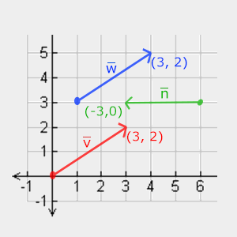
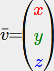
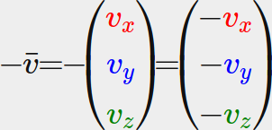
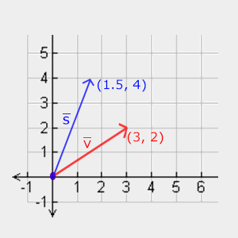
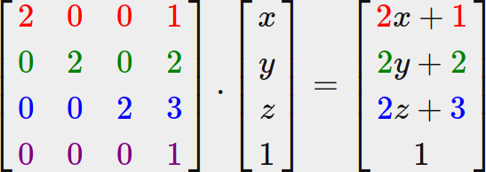
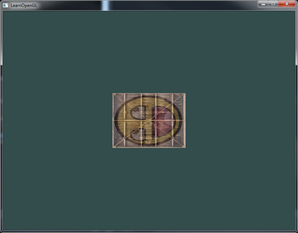

# Transformations

We now know how to create objects, color them and/or give them a detailed appearance using textures, but they're still not that interesting since they're all static objects. We could try and make them move by changing their vertices and re-configuring their buffers each frame, but that's cumbersome and costs quite some processing power. There are much better ways to transform an object and that's by using (multiple) matrix objects. This doesn't mean we're going to talk about kungfu and a large digital artificial world.

Matrices are very powerful mathematical constructs that seem scary at first, but once you'll grow accustomed to them they'll prove extremely useful. When discussing matrices, we'll have to make a small dive into some mathematics and for the more mathematically inclined readers I'll post additional resources for further reading.

However, to fully understand transformations we first have to delve a bit deeper into vectors before discussing matrices. The focus of this chapter is to give you a basic mathematical background in topics we will require later on. If the subjects are difficult, try to understand them as much as you can and come back to this page later to review the concepts whenever you need them.

## Vectors

In its most basic definition, vectors are directions and nothing more. A vector has a direction and a magnitude (also known as its strength or length). You can think of vectors like directions on a treasure map: 'go left 10 steps, now go north 3 steps and go right 5 steps'; here 'left' is the direction and '10 steps' is the magnitude of the vector. The directions for the treasure map thus contains 3 vectors. Vectors can have any dimension, but we usually work with dimensions of 2 to 4. If a vector has 2 dimensions it represents a direction on a plane (think of 2D graphs) and when it has 3 dimensions it can represent any direction in a 3D world.

Below you'll see 3 vectors where each vector is represented with (x,y) as arrows in a 2D graph. Because it is more intuitive to display vectors in 2D (than in 3D) you can think of the 2D vectors as 3D vectors with a z coordinate of 0. Since vectors represent directions, the origin of the vector does not change its value. In the graph below we can see that the vectors **v**
and **w** are equal even though their origin is different:



When describing vectors mathematicians generally prefer to describe vectors as character symbols with a little bar over their head. However, we can't do that in Markdown, so we'll bold vector names instead, like **v**. Also, when displaying vectors in formulas they are generally displayed as follows:



Because vectors are specified as directions it is sometimes hard to visualize them as positions. What we basically visualize is we set the origin of the direction to **(0,0,0)** and then point towards a certain direction that specifies the point, making it a position vector (we could also specify a different origin and then say: 'this vector points to that point in space from this origin'). The position vector **(3,5)** would then point to **(3,5)** on the graph with an origin of **(0,0)**. Using vectors we can thus describe directions and positions in 2D and 3D space.

Just like with normal numbers we can also define several operations on vectors (some of which you've already seen).

## Scalar vector operations

A scalar is a single digit (or a vector with 1 component if you'd like stay in vector-land). When adding/subtracting/multiplying or dividing a vector with a scalar we simply add/subtract/multiply or divide each element of the vector by the scalar. For addition it would look like this:


  
Where **+** can be **+**,**-**, **•** or **÷** where **•** is the multiplication operator. Keep in mind that for the **-** and **÷** operator order, the reverse order is not defined.

## Vector negation

Negating a vector results in a vector in the reversed direction. A vector pointing north-east would point south-west after negation. To negate a vector we add a minus-sign to each component (you can also represent it as a scalar-vector multiplication with a scalar value of -1):



## Addition and subtraction

Addition of two vectors is defined as component-wise addition, that is each component of one vector is added to the same component of the other vector like so:


Visually, it looks like this on vectors **v=(4,2)** and **k=(1,2)**:


Just like normal addition and subtraction, vector subtraction is the same as addition with a negated second vector:


Subtracting two vectors from each other results in a vector that's the difference of the positions both vectors are pointing at. This proves useful in certain cases where we need to retrieve a vector that's the difference between two points.


## Length

To retrieve the length/magnitude of a vector we use the Pythagoras theorem that you might remember from your math classes. A vector forms a triangle when you visualize its individual **x** and **y** component as two sides of a triangle:


  
Where **||v||** is denoted as *the length of vector* **v**. This is easily extended to 3D by adding **z^2** to the equation.

In this case the length of vector **(4, 2)** equals:
  


Which is **4.47**.

There is also a special type of vector that we call a *unit vector*. A unit vector has one extra property and that is that its length is exactly 1. We can calculate a unit vector **n** from any vector by dividing each of the vector's components by its length:
  


We call this *normalizing* a vector. Unit vectors are displayed with a little roof over their head and are generally easier to work with, especially when we only care about their directions (the direction does not change if we change a vector's length).

## Vector-vector multiplication

Multiplying two vectors is a bit of a weird case. Normal multiplication isn't really defined on vectors since it has no visual meaning, but we have two specific cases that we could choose from when multiplying: one is the *dot product* denoted as **v** • **k** and the other is the *cross product* denoted as **v** × **k**.

### Dot product

The dot product of two vectors is equal to the scalar product of their lengths times the cosine of the angle between them. If this sounds confusing take a look at its formula:


Where the angle between them is represented as theta (θ). Why is this interesting? Well, imagine if **v** and **k** are unit vectors then their length would be equal to 1. This would effectively reduce the formula to:


Now the dot product **only** defines the angle between both vectors. You might remember that the cosine or cos function becomes **0** when the angle is 90 degrees or **1** when the angle is 0. This allows us to easily test if the two vectors are *orthogonal* or parallel to each other using the dot product (orthogonal means the vectors are at a *right-angle* to each other). In case you want to know more about the **sin** or the **cosine** functions I'd suggest the following [Khan Academy videos](https://www.khanacademy.org/math/trigonometry/basic-trigonometry/basic_trig_ratios/v/basic-trigonometry) about basic trigonometry.

>You can also calculate the angle between two non-unit vectors, but then you'd have to divide the lengths of both vectors from the result to be left with **cos θ**.

So how do we calculate the dot product? The dot product is a component-wise multiplication where we add the results together. It looks like this with two unit vectors (you can verify that both their lengths are exactly **1**):


To calculate the degree between both these unit vectors we use the inverse of the cosine function **cos^-1**, and this results in **143.1** degrees. We now effectively calculated the angle between these two vectors. The dot product proves very useful when doing lighting calculations.

## Cross product

The cross product is only defined in 3D space and takes two non-parallel vectors as input and produces a third vector that is orthogonal to both the input vectors. If both the input vectors are orthogonal to each other as well, a cross product would result in 3 orthogonal vectors. This will prove useful in the upcoming tutorials. The following image shows what this looks like in 3D space:


Unlike the other operations, the cross product isn't really intuitive without delving into linear algebra so it's best to just memorize the formula and you'll be fine (or don't, you'll probably be fine as well). Below you'll see the cross product between two orthogonal vectors A and B:
  

  
As you can see, it doesn't really seem to make sense. However, if you just follow these steps you'll get another vector that is orthogonal to your input vectors.

## Matrices

Now that we've discussed almost all there is to vectors it is time to enter the matrix! A matrix is basically a rectangular array of numbers, symbols and/or expressions. Each individual item in a matrix is called an element of the matrix. An example of a 2x3 matrix is shown below:


Matrices are indexed by **(i,j)** where **i** is the row and **j** is the column, that is why the above matrix is called a 2x3 matrix (3 columns and 2 rows, also known as the dimensions of the matrix). This is the opposite of what you're used to when indexing 2D graphs as **(x,y)**. To retrieve the value 4 we would index it as (2,1) (second row, first column).

>It is important to note that OpenTK stores its matrices in column-major form, **not** row-major form. This doesn't have a major impact on most matrix operations, but I'll be sure to point out whenever it has an effect.

Matrices are basically nothing more than that, just rectangular arrays of mathematical expressions. They do have a very nice set of mathematical properties and just like vectors we can define several operations on matrices, namely: addition, subtraction and multiplication.

## Matrix addition and subtraction

Addition and subtraction between a matrix and a scalar is defined as follows:


The scalar value is basically added to each individual element of the matrix. The same applies for matrix-scalar subtraction:


Matrix addition and subtraction between two matrices is done on a per-element basis. So the same general rules apply that we're familiar with for normal numbers, but done on the elements of both matrices with the same index. This does mean that addition and subtraction is only defined for matrices of the same dimensions. A 3x2 matrix and a 2x3 matrix (or a 3x3 matrix and a 4x4 matrix) cannot be added or subtracted together. Let's see how matrix addition works on two 2x2 matrices:


The same rules apply for matrix subtraction:
  


## Matrix-scalar products

Just like addition and subtraction, a matrix-scalar product multiples each element of the matrix by a scalar. The following example illustrates the multiplication:


Now it also makes sense as to why those single numbers are called scalars. A scalar basically scales all the elements of the matrix by its value. In the previous example, all elements were scaled by 2.

So far so good, all of our cases weren't really too complicated. That is, until we start on matrix-matrix multiplication.

## Matrix-matrix multiplication

Multiplying matrices is not necessarily complex, but rather difficult to get comfortable with. Matrix multiplication basically means to follow a set of pre-defined rules when multiplying. There are a few restrictions though:

1. You can only multiply two matrices if the number of columns on the left-hand side matrix is equal to the number of rows on the right-hand side matrix.
2. Matrix multiplication is not commutative. That is, A • B does not equal B • A.

Let's get started with an example of a matrix multiplication of two 2x2 matrices:


Right now you're probably trying to figure out what the hell just happened? Matrix multiplication is a combination of normal multiplication and addition using the left-matrix's rows with the right-matrix's columns. Let's try discussing this with the following image:


We first take the upper row of the left matrix and then take a column from the right matrix. The row and column that we picked decides which output value of the resulting 2x2 matrix we're going to calculate. If we take the first row of the left matrix the resulting value will end up in the first row of the result matrix, then we pick a column and if it's the first column the result value will end up in the first column of the result matrix. This is exactly the case of the red pathway. To calculate the bottom-right result we take the bottom row of the first matrix and the rightmost column of the second matrix.

To calculate the resulting value we multiply the first element of the row and column together using normal multiplication, we do the same for the second elements, third, fourth etc. The results of the individual multiplications are then summed up and we have our result. Now it also makes sense that one of the requirements is that the size of the left-matrix's columns and the right-matrix's rows are equal, otherwise we can't finish the operations!

The result is then a matrix that has dimensions of **(n,m)** where n is equal to the number of rows of the left-hand side matrix and m is equal to the columns of the right-hand side matrix.

Don't worry if you have difficulties imagining the multiplications inside your head. Just keep trying to do the calculations by hand and return to this page whenever you have difficulties. Over time, matrix multiplication becomes second nature to you.

Let's finish the discussion of matrix-matrix multiplication with a larger example. Try to visualize the pattern using the colors. As a useful exercise, see if you can come up with your own answer of the multiplication and then compare them with the resulting matrix (once you try to do a matrix multiplication by hand you'll quickly get the grasp of them).


As you can see, matrix-matrix multiplication is quite a cumbersome process and very prone to errors (which is why we usually let computers do this) and this gets problematic real quick when the matrices become larger. If you're still thirsty for more and you're curious about some more of the mathematical properties of matrices I strongly suggest you take a look at these [Khan Academy videos](https://www.khanacademy.org/math/algebra2/algebra-matrices) about matrices.

Anyways, now that we know how to multiply matrices together, we can start getting to the good stuff.

## Matrix-Vector multiplication

Up until now we've had our fair share of vectors these tutorials. We used vectors to represent positions, colors and even texture coordinates. Let's move a bit further down the rabbit hole and tell you that a vector is basically a Nx1 matrix where N is the vector's number of components (also known as an N-dimensional vector). If you think about it, it makes a lot of sense. Vectors are just like matrices an array of numbers, but with only 1 column. So, how does this new piece of information help us? Well, if we have a MxN matrix we can multiply this matrix by our Nx1 vector, since the columns of our matrix are equal to the number of rows of our vector, thus matrix multiplication is defined.

But why do we care if we can multiply matrices with a vector? Well, it just so happens that there are lots of interesting 2D/3D transformations we can place inside a matrix and multiplying that matrix with our vector basically transforms our vector. In case you're still a bit confused, let's start with some examples and you'll soon see what we mean.

### Identity matrix

In OpenGL we usually work with 4x4 transformation matrices for several reasons and one of them is that most of the vectors are of size 4. The most simple transformation matrix that we can think of is the identity matrix. The identity matrix is an NxN matrix with only 0s except on its diagonal. As you'll see, this transformation matrix leaves a vector completely unharmed:


The vector seems completely untouched. This becomes obvious from the rules of multiplication: the first result element is each individual element of the first row of the matrix multiplied with each element of the vector. Since each of the row's elements are 0 except the first one, we get: `1 • 1 + 0 • 2 + 0 • 3 + 0 • 4 = 1` and the same applies for the other 3 elements of the vector.

>You might be wondering what the use is of a transformation matrix that does not transform? The identity matrix is usually a starting point for generating other transformation matrices and if we dig even deeper into linear algebra, a very useful matrix for proving theorems and solving linear equations.

### Scaling

When we're scaling a vector we are increasing the length of the arrow by amount we'd like to scale, keeping its direction the same. Since we're working in either 2 or 3 dimensions we can define scaling by a vector of 2 or 3 scaling variables, each scaling one axis (x, y or z).

Let's try scaling the vector **v** = (3,2). We will scale the vector along the x-axis by **0.5**, thus making it twice as narrow; and we'll scale the vector by **2** along the y-axis, making it twice as high. Let's see what it looks like if we scale the vector by **(0.5,2)** as **s**:



Keep in mind that OpenGL usually operates in 3D space so for this 2D case we could set the z-axis scale to 1 thus leaving it unharmed. The scaling operation we just performed is a non-uniform scale, because the scaling factor is not the same for each axis. If the scalar would be equal on all axes it would be called a uniform scale.

Let's start building a transformation matrix that does the scaling for us. We saw from the identity matrix that each of the diagonal elements were multiplied with its corresponding vector element. What if we were to change the **1**s in the identity matrix to **3**s? In that case, we would be multiplying each of the vector elements by a value of **3** and thus effectively scale the vector by 3. If we represent the scaling variables as (S1, S2, S3) we can define a scaling matrix on any vector **(x,y,z)** as:


Note that the 4th scaling vector stays 1, since it's undefined to scale the **w** component in a 3D space. The **w** component is used for other purposes as we'll see later on.

### Translation

*Translation* is the process of adding another vector on top of the original vector to return a new vector with a different position, thus moving the vector based on a translation vector. We've already discussed vector addition so this shouldn't be too new.

Just like the scaling matrix there are several locations on a 4-by-4 matrix that we can use to perform certain operations and for translation those are the top-3 values of the 4th column. If we represent the translation vector as (Tx, Ty, Tz) we can define the translation matrix by:


This works because all of the translation values are multiplied by the vector's **w** column and added to the vector's original values (remember the matrix-multiplication rules). This wouldn't have been possible with a 3-by-3 matrix.

>### Homogeneous coordinates
>
>The **w** component of a vector is also known as a *homogeneous coordinate*.
>To get the 3D vector from a homogeneous vector we divide the **x**, **y** and **z** coordinate by its **w** coordinate. We usually do not notice this since the **w** component is **1.0** most of the time. Using homogeneous coordinates has several advantages: it allows us to do translations on 3D vectors (without a **w** component we can't translate vectors) and in the next chapter we'll use the **w** value to create 3D visuals.
>Also, whenever the homogeneous coordinate is equal to **0** the vector is specifically known as a *direction vector* since a vector with a **w** coordinate of **0** cannot be translated.

With a translation matrix we could move objects in any of the 3 directions (**x**, **y**, **z**) we'd like, making it a very useful transformation matrix for our transformation toolkit.

### Rotation

The last few transformations were relatively easy to understand and visualize in 2D or 3D space, but rotations are a bit trickier. If you want to know exactly how these matrices are constructed I'd recommend that you watch the rotation items of Khan Academy's [linear algebra videos](https://www.khanacademy.org/math/linear-algebra/matrix_transformations).

First let's define what a rotation of a vector actually is. A rotation in 2D or 3D is represented with an angle. An angle could be in degrees or radians where a whole circle has 360 degrees or 2 PI radians. I personally prefer to work in degrees, since they seem to make more sense to me.

>Most rotation functions require an angle in radians, but luckily degrees are easily converted to radians:
angle in degrees = angle in radians * (180.0f / PI)
angle in radians = angle in degrees * (PI / 180.0f)
Where PI equals (sort of) 3.14159265359.
In addition, OpenTK provides the function `MathHelper.DegreesToRadians` to easily convert to radians.

Rotating half a circle would rotate us 360/2 = 180 degrees and rotating 1/5th to the right means we rotate 360/5 = 72 degrees to the right. This is demonstrated for a basic 2D vector where **v** is rotated 72 degrees to the right from **k**:


Rotations in 3D are specified with an angle and a rotation axis. The angle specified will rotate the object along the rotation axis given. Try to visualize this by spinning your head a certain degree while continually looking down a single rotation axis. When rotating 2D vectors in a 3D world for example, we set the rotation axis to the z-axis (try to visualize this).

Using trigonometry it is possible to transform vectors to new rotated vectors given an angle. This is usually done via a smart combination of the sine and cosine function (commonly abbreviated to **sin** and **cos**). A discussion of how the transformation matrices are generated is out of the scope of this tutorial.

A rotation matrix is defined for each unit axis in 3D space where the angle is represented as the theta symbol θ.

Rotation around the X-axis:


Rotation around the Y-axis:


Rotation around the Z-axis:


Using the rotation matrices we can transform our position vectors around one of the three unit axes. It is also possible to combine them by first rotating around the X-axis and then the Y-axis for example. However, this quickly introduces a problem called *Gimbal lock*. We won't discuss the details, but a better solution is to rotate around an arbitrary unit axis e.g. **(0.662,0.2,0.722)** (note that this is a unit vector) right away instead of combining the rotation matrices. Such a (nasty) matrix exists and is given below with (Rx, Ry, Rz) as the arbitrary rotation axis:


A mathematical discussion of generating such a matrix is out of the scope of this tutorial. Keep in mind that even this matrix does not completely prevent gimbal lock (although it gets a lot harder). To truly prevent Gimbal locks we have to represent rotations using *quaternions*, that are not only safer, but also more computationally friendly. However, a discussion of quaternions is reserved for a later tutorial.

### Combining matrices

The true power from using matrices for transformations is that we can combine multiple transformations in a single matrix thanks to matrix-matrix multiplication. Let's see if we can generate a transformation matrix that combines several transformations. Say we have a vector (x,y,z) and we want to scale it by 2 and then translate it by (1,2,3). We need a translation and a scaling matrix for our required steps. The resulting transformation matrix would then look like:


Note that we first do a translation and then a scale transformation when multiplying matrices. Matrix multiplication is not commutative, which means their order is important. When multiplying matrices the right-most matrix is first multiplied with the vector so you should read the multiplications from right to left. It is advised to first do scaling operations, then rotations and lastly translations when combining matrices otherwise they might (negatively) affect each other. For example, if you would first do a translation and then scale, the translation vector would also scale!

Running the final transformation matrix on our vector results in the following vector:



Great! The vector is first scaled by two and then translated by **(1,2,3)**.

## In practice

OpenTK provides its own mathematics library, so there's no need to add another one. Let's see if we can put our transformation knowledge to good use by translating a vector of **(1,0,0)** by **(1,1,0)** (note that we define it as a Vector4 with its homogenous coordinate set to 1.0:

```cs
Vector4 vec = new Vector4(1.0f, 0.0f, 0.0f, 1.0f);
Matrix4 trans = Matrix4.CreateTranslation(0.1f, 0.1f, 0.0f);
vec *= trans;
Console.WriteLine("{0}, {1}, {2}", vec.x, vec.y, vec.z);
```

We first define a vector named vec using OpenTK's built-in vector class. Next we define a Matrix4 and explicitly initialize it to the identity matrix by calling the `Matrix4.CreateTranslation` function, which takes three floats and creates a translation matrix.

Then we multiply our vector by the transformation matrix and output the result. If we still remember how matrix translation works then the resulting vector should be **(1+1,0+1,0+0)** which is **(2,1,0)**. This snippet of code outputs 210 so the translation matrix did its job.

Let's do something more interesting and scale and rotate the container object from the previous tutorial:

```cs
Matrix4 rotation = Matrix4.CreateRotationZ(MathHelper.DegreesToRadians(90.0f));
Matrix4 scale = Matrix4.CreateScale(0.5f, 0.5f, 0.5f);
Matrix4 trans = rotation * scale;
```

We create two matrices: one to rotate 90 degrees on the Z axis, and the other to scale on all axes by 0.5. OpenTK expects its angles in radians so we convert the degrees to radians using `MathHelper.DegreesToRadians`. Note that the textured rectangle is on the XY plane so we want to rotate around the Z-axis. Keep in mind that the axis that we rotate around should be a unit vector, so be sure to normalize the vector first if you're not rotating around the X, Y, or Z axis. Then, we multiply the matrices together to create a single transformation matrix.

The next big question is: how do we get the transformation matrix to the shaders? We shortly mentioned before that GLSL also has a mat4 type. So we'll adapt the vertex shader to accept a mat4 uniform variable and multiply the position vector by the matrix uniform:

```glsl
#version 330 core
layout (location = 0) in vec3 aPos;
layout (location = 1) in vec2 aTexCoord;

out vec2 TexCoord;
  
uniform mat4 transform;

void main()
{
    gl_Position = transform * vec4(aPos, 1.0f);
    TexCoord = vec2(aTexCoord.x, aTexCoord.y);
}
```

>GLSL also has mat2 and mat3 types that allow for swizzling-like operations just like vectors. All the aforementioned math operations (like scalar-matrix multiplication, matrix-vector multiplication and matrix-matrix multiplication) are allowed on the matrix types. Wherever special matrix operations are used we'll be sure to explain what's happening.

We added the uniform and multiplied the position vector with the transformation matrix before passing it to gl_Position. Our container should now be half its size and rotated 90 degrees on the Z axis (tilted to the left). We still need to pass the transformation matrix to the shader though:

```cs
GL.UseProgram(program);

int location = GL.GetUniformLocation(Handle, name);

GL.UniformMatrix4(location, true, ref matrix);
```

`GL.UniformMatrix4` is a fairly standard function, similar to the other Uniform functions we've seen so far. The parameters are as follows:

- The location of the uniform on the shader.
- A boolean, determining whether or not the matrices should be transposed. Since OpenTK uses row-major, whereas GLSL typically uses column-major, you'll almost always want to use `true` here.
- A reference to the matrix we want to pass.

We created a transformation matrix, declared a uniform in the vertex shader and sent the matrix to the shaders where we transform our vertex coordinates. The result should look something like this:



Perfect! Our container is indeed tilted to the left and twice as small so the transformation was successful.

If you didn't get the right result or you're stuck somewhere else, take a look at the source code and the updated shader class.

In the next tutorial we'll discuss how we can use matrices to define different coordinate spaces for our vertices. This will be our first step into real-time 3D graphics!